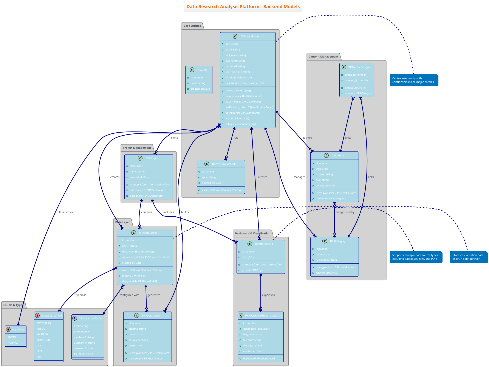

# Data Research Analysis Platform - Comprehensive Architecture Documentation

## Table of Contents
- [Overview](#overview)
- [System Architecture](#system-architecture)
- [Class Diagrams](#class-diagrams)
- [Activity Diagrams](#activity-diagrams)
- [Sequence Diagrams](#sequence-diagrams)
- [Key Architectural Decisions](#key-architectural-decisions)
- [Technology Stack](#technology-stack)

## Overview

The Data Research Analysis Platform is a full-stack web application that enables users to connect to multiple data sources, build custom data models, and create interactive dashboards. The platform supports various data source types including databases (PostgreSQL, MySQL, MariaDB, MongoDB) and file formats (CSV, Excel, PDF).

### Key Features
- Multi-tenant user management with role-based access
- Multiple data source connectivity
- PDF document processing with OCR capabilities
- Real-time processing updates via Socket.IO
- Interactive dashboard creation and export
- Background job processing for heavy operations
- JWT-based authentication with email verification

## System Architecture

The platform follows a modern microservices-inspired architecture with clear separation of concerns:

- **Frontend**: Vue 3/Nuxt 3 SPA with Pinia state management
- **Backend**: Node.js/Express with TypeScript and ES modules
- **Database**: PostgreSQL with TypeORM for entity management
- **Real-time Communication**: Socket.IO for live updates
- **File Processing**: Worker threads for PDF/image processing
- **Queue System**: Background job processing for heavy operations
- **Cloud Integration**: AWS S3 for file storage and Textract for OCR

---

## Class Diagrams

### 1. Backend Models Class Diagram

This diagram shows the core data entities and their relationships in the PostgreSQL database.



**Key Points:**
- Central user entity (`DRAUsersPlatform`) with relationships to all major entities
- Support for multiple data source types including PDF processing
- Project-based organization of data sources and dashboards
- Content management system for articles and categories
- Export metadata tracking for dashboard exports

### 2. Services Architecture Class Diagram

This diagram illustrates the service layer components and their dependencies.

```plantuml
[Content from services-architecture-class-diagram.puml]
```

**Key Points:**
- Singleton pattern implementation for all services
- Clear separation between core services, file services, and infrastructure
- AWS integration for cloud storage and text extraction
- Worker service for background processing with queue management
- Database driver abstraction supporting multiple database types

---

## Activity Diagrams

### 3. PDF Processing Activity Diagram

This diagram shows the complete workflow for PDF file upload and processing.

```plantuml
[Content from pdf-processing-activity-diagram.puml]
```

**Key Features:**
- Automatic file renaming with timestamp and user ID
- Real-time progress tracking via Socket.IO
- Background processing using worker threads
- Error handling and retry mechanisms
- Support for multiple file uploads

### 4. Authentication Activity Diagram

This diagram illustrates the user registration, email verification, and login process.

```plantuml
[Content from authentication-activity-diagram.puml]
```

**Security Features:**
- Email verification requirement
- Password hashing with bcrypt and configurable salt
- JWT token generation with expiration
- Session management and logout handling
- Protection against unverified account access

---

## Sequence Diagrams

### 5. Real-time Communication Sequence Diagram

This diagram shows Socket.IO interactions for real-time updates.

```plantuml
[Content from realtime-communication-sequence-diagram.puml]
```

**Communication Features:**
- Persistent WebSocket connections with fallback
- Event-driven architecture for real-time updates
- Background job completion notifications
- Automatic reconnection handling
- Progress tracking for long-running operations

### 6. API Integration Sequence Diagram

This diagram demonstrates typical API request/response cycles with authentication.

```plantuml
[Content from api-integration-sequence-diagram.puml]
```

**API Features:**
- JWT-based authentication middleware
- RESTful API design patterns
- Comprehensive error handling
- Rate limiting protection
- Resource ownership validation

---

## Key Architectural Decisions

### 1. **ES Modules with TypeScript**
- **Decision**: Use ES modules throughout the codebase with `.js` extensions in imports
- **Rationale**: Modern JavaScript standards, better tree-shaking, future-proof
- **Impact**: Required custom worker configuration and careful module resolution

### 2. **Socket.IO Integration**
- **Decision**: Share HTTP server between Express and Socket.IO
- **Rationale**: Avoid port conflicts, simplify deployment, enable real-time features
- **Implementation**: SocketIODriver accepts HTTP server instance instead of creating its own

### 3. **Worker Threads for Processing**
- **Decision**: Use Node.js worker threads for heavy PDF processing
- **Rationale**: Prevent main thread blocking, improve scalability
- **Implementation**: Background queue system with job management

### 4. **Automatic File Naming**
- **Decision**: Programmatically rename uploaded files with timestamp and user ID
- **Rationale**: Prevent naming conflicts, improve organization, enhance security
- **Format**: `{timestamp}_{userId}_{originalName}`

### 5. **Service Layer Architecture**
- **Decision**: Singleton pattern for all services with clear dependency injection
- **Rationale**: Memory efficiency, consistent state management, easier testing
- **Benefits**: Centralized configuration, reduced coupling

### 6. **Multi-Database Support**
- **Decision**: Abstract database drivers with unified interface
- **Rationale**: Support various data sources, flexible deployment options
- **Implementation**: Driver pattern with PostgreSQL, MySQL, MariaDB support

### 7. **JWT Authentication**
- **Decision**: Stateless JWT tokens with email verification requirement
- **Rationale**: Scalability, mobile app support, distributed architecture
- **Security**: Short expiration times, secure token storage

### 8. **Background Job Processing**
- **Decision**: Queue-based processing for heavy operations
- **Rationale**: Improve user experience, handle large files, prevent timeouts
- **Implementation**: theta-mn-queue with worker thread integration

## Technology Stack

### Backend Technologies
- **Runtime**: Node.js v18+ with ES modules
- **Framework**: Express.js with TypeScript
- **Database**: PostgreSQL with TypeORM
- **Authentication**: JWT with bcrypt password hashing
- **Real-time**: Socket.IO for WebSocket communication
- **File Processing**: Multer for uploads, worker threads for processing
- **Queue**: theta-mn-queue for background jobs
- **Cloud**: AWS S3 for storage, AWS Textract for OCR
- **Email**: NodeMailer for email delivery

### Frontend Technologies
- **Framework**: Vue 3 with Composition API
- **Meta-framework**: Nuxt 3 for SSR/SPA
- **State Management**: Pinia for reactive state
- **Styling**: Tailwind CSS for utility-first styling
- **HTTP Client**: Native fetch API with interceptors
- **Real-time**: Socket.IO client for live updates
- **Build**: Vite for fast development and building

### Infrastructure & DevOps
- **Containerization**: Docker with multi-service composition
- **Database**: PostgreSQL with persistent volumes
- **Caching**: Redis for session and queue management
- **Process Management**: PM2 for production deployment
- **Environment**: dotenv for configuration management
- **Logging**: Winston for structured logging

### Development Tools
- **TypeScript**: Strong typing throughout the stack
- **ESLint**: Code linting and formatting
- **Vitest**: Unit and integration testing
- **PlantUML**: Architecture documentation
- **Git**: Version control with feature branches

This comprehensive architecture provides a scalable, maintainable foundation for the Data Research Analysis Platform, supporting current requirements while enabling future enhancements and integrations.