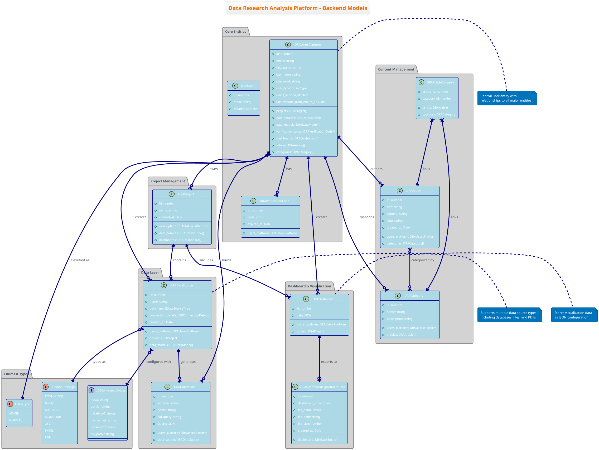

# Data Research Analysis Platform - Comprehensive Architecture Documentation

## Table of Contents
- [Overview](#overview)
- [System Architecture](#system-architecture)
- [Class Diagrams](#class-diagrams)
  - [Backend Models](#1-backend-models-class-diagram)
  - [Services Architecture](#2-services-architecture-class-diagram)
  - [Frontend Components](#3-frontend-components-and-store-architecture)
- [Activity Diagrams](#activity-diagrams)
  - [PDF Processing](#3-pdf-processing-activity-diagram)
  - [Authentication](#4-authentication-activity-diagram)
- [Sequence Diagrams](#sequence-diagrams)
  - [Real-time Communication](#5-real-time-communication-sequence-diagram)
  - [API Integration](#6-api-integration-sequence-diagram)
  - [Cascade Deletion](#7-cascade-deletion-sequence-diagram)
  - [Data Manipulation](#8-data-manipulation-workflows)
- [Key Architectural Decisions](#key-architectural-decisions)
- [Technology Stack](#technology-stack)
- [Recent Enhancements](#recent-enhancements)
- [PlantUML Diagrams Index](#plantuml-diagrams-index)
- [Conclusion](#conclusion)

## Overview

The Data Research Analysis Platform is a full-stack web application that enables users to connect to multiple data sources, build custom data models, and create interactive dashboards. The platform supports various data source types including databases (PostgreSQL, MySQL, MariaDB) and file formats (CSV, Excel, PDF).

### Key Features
- Multi-tenant user management with role-based access (ADMIN/NORMAL)
- Multiple data source connectivity with encrypted credentials
- Comprehensive cascade deletion with transaction safety
- PDF document processing with OCR capabilities
- Real-time processing updates via Socket.IO
- Interactive dashboard creation and export with JSONB storage
- Background job processing for heavy operations
- JWT-based authentication with TokenProcessor
- Email verification and password reset workflows
- Server-side rendering (SSR) with client-side hydration
- Reactive state management with Pinia stores
- Automatic encryption/decryption of sensitive data
- 11 singleton processors for business logic separation

## System Architecture

The platform follows a modern microservices-inspired architecture with clear separation of concerns:

- **Frontend**: Vue 3/Nuxt 3 SSR/SPA hybrid with Pinia state management
  - 8 Pinia stores with localStorage synchronization
  - Global middleware for data loading and validation
  - Computed properties pattern for reactivity
  - Composables for shared utilities
- **Backend**: Node.js/Express with TypeScript and ES modules
  - 11 singleton processors for business logic
  - Service layer with dependency injection
  - Automatic encryption via TypeORM ValueTransformer
  - Transaction-based cascade deletion
- **Database**: PostgreSQL with TypeORM for entity management
  - Encrypted sensitive fields (AES-256-CBC)
  - Cascade deletion relationships
  - JSONB for flexible data structures
- **Real-time Communication**: Socket.IO for live updates
- **File Processing**: Worker threads for PDF/image processing
- **Queue System**: Background job processing for heavy operations
- **Cloud Integration**: AWS S3 for file storage and Textract for OCR
- **Security**: JWT tokens via TokenProcessor, bcrypt password hashing
- **Middleware**: Route guards for authentication and data loading

---

## Class Diagrams

### 1. Backend Models Class Diagram

This diagram shows the core data entities and their relationships in the PostgreSQL database.



**Key Points:**
- **Central user entity** (`DRAUsersPlatform`) with relationships to all major entities
- **Encrypted connection details** in `DRADataSource` using ValueTransformer (AES-256-CBC)
- **Cascade deletion annotations**: `{cascade: ["remove", "update"]}` and `{onDelete: 'CASCADE'}`
- **Project-based organization** with description field for better categorization
- **Article management** with `content_markdown` support and `EPublishStatus` (PUBLISHED/DRAFT)
- **Dashboard export tracking** with metadata in `DRADashboardExportMetaData`
- **Physical table management**: Tables are dropped when data models are deleted
- **Transaction safety**: All cascade operations wrapped in database transactions
- **JSONB storage**: Dashboard configurations stored as JSON for flexibility

### 2. Services Architecture Class Diagram

This diagram illustrates the service layer components, business logic processors, and their dependencies.

```plantuml
[Content from services-architecture-class-diagram.puml]
```

**Key Points:**

**Core Services:**
- **UtilityService**: JWT generation/verification, password hashing, email sending, UUID generation
- **EncryptionService**: AES-256-CBC encryption/decryption, automatic via TypeORM ValueTransformer
- **QueueService**: Background job management for PDF conversion and text extraction
- **WorkerService**: Spawns worker threads for CPU-intensive operations

**Business Logic Processors (11 total):**
1. **ArticleProcessor**: Article CRUD, slug generation (kebab-case, 100 char max), category associations, publish status management
2. **AuthProcessor**: Login, registration, email verification, password reset, integrates with TokenProcessor
3. **CategoryProcessor**: Category management with admin privileges, cascade deletion of article associations
4. **DashboardProcessor**: Dashboard CRUD, JSONB data storage, export metadata management
5. **DataModelProcessor**: Data model operations, physical table drops, dashboard reference cleanup
6. **DataSourceProcessor**: External DB connections, encryption of credentials, Excel/PDF processing, date formatting, SQL escaping
7. **PrivateBetaUserProcessor**: Beta user invitation and management
8. **ProjectProcessor**: Project lifecycle, cascade deletion coordinator (data sources → models → dashboards)
9. **TokenProcessor**: JWT generation, validation, token details extraction for authentication
10. **UserManagementProcessor**: Admin operations for user management, user type updates
11. **UserProcessor**: User profile operations, password changes, account settings

**Architectural Patterns:**
- **Singleton Pattern**: All services and processors use `getInstance()` method
- **Dependency Injection**: Services injected via constructor or method parameters
- **Separation of Concerns**: Routes → Processors → Services → Drivers
- **Transaction Management**: Processors wrap critical operations in database transactions
- **Encryption Layer**: EncryptionService transparently encrypts/decrypted sensitive data

### 3. Frontend Components and Store Architecture

```plantuml
[Content from frontend-components-class-diagram.puml]
```

**Pinia Stores (8 stores):**
1. **useProjectsStore**: Project CRUD, selected project state, localStorage sync
2. **useDataSourceStore**: Data source management, connection details, filtering by project
3. **useDataModelsStore**: Data model operations, table metadata, dashboard integration
4. **useDashboardsStore**: Dashboard configurations, JSONB data, export operations
5. **useArticlesStore**: Article and category management, publish status filtering
6. **useLoggedInUserStore**: Authentication state, JWT token management, user profile
7. **usePrivateBetaUserStore**: Beta user invitation list, admin operations
8. **useUserManagementStore**: User administration, type updates, user list

**Store Reactivity Pattern (CRITICAL):**
```typescript
// ✅ CORRECT - Direct ref access in computed properties
const data_models = computed(() => {
    return dataModelsStore.dataModels
        .filter(model => model.data_source.id === dataSource.value.id)
        .map(model => ({ id: model.id, name: model.name }));
});

// ❌ WRONG - Causes infinite recursion
const data_models = computed(() => {
    return dataModelsStore.getDataModels()  // This mutates dataModels.value!
        .filter(model => ...);
});
```

**Why this matters:**
- Getter methods (`getDataModels()`) check localStorage and mutate the ref
- Calling them in computed properties triggers infinite recalculation
- Solution: Access store refs directly (`store.dataModels`)

**Global Middleware:**
- **02-load-data.global.ts**: Loads all store data on every route navigation
  - Ensures fresh data after CRUD operations
  - Compatible with SSR/CSR hydration
  - Runs before route components mount
- **03-validate-data.global.ts**: Validates route parameters and authentication
  - Checks if project/data source/model exists
  - Redirects invalid routes to appropriate pages
  - Prevents broken state from bad URLs

**Composables:**
- **Utils.ts**: Shared utilities across components
  - `baseUrl()`: API base URL configuration
  - `getAuthToken()`, `setAuthToken()`, `removeAuthToken()`: Token management
  - `enableRefreshDataFlag()`, `shouldRefreshData()`: Data refresh coordination

**Component Patterns:**
- Use computed properties over watchers for store data
- Avoid watching entire store objects (causes recursion)
- Access refs directly in computed for proper dependency tracking
- Let middleware handle data loading, components consume reactive state

---

## Activity Diagrams

### 3. PDF Processing Activity Diagram

This diagram shows the complete workflow for PDF file upload and processing.

```plantuml
[Content from pdf-processing-activity-diagram.puml]
```

**Key Features:**
- Automatic file renaming with timestamp and user ID
- Real-time progress tracking via Socket.IO
- Background processing using worker threads
- Error handling and retry mechanisms
- Support for multiple file uploads

### 4. Authentication Activity Diagram

This diagram illustrates the user registration, email verification, and login process with TokenProcessor integration.

```plantuml
[Content from authentication-activity-diagram.puml]
```

**Security Features:**
- **Email verification requirement** before account activation
- **Password hashing** with bcrypt using PASSWORD_SALT from environment (UtilityService methods)
- **JWT token generation** via TokenProcessor.generateToken() with payload containing:
  - user_id, email, user_type, iat (issued at), exp (expiration)
- **Token validation** via TokenProcessor.validateToken() on every protected route:
  - Checks JWT signature
  - Verifies expiration time
  - Validates token structure
- **Token details extraction** via TokenProcessor.getTokenDetails() for user context
- **Session management** with JWT stored in localStorage
- **Middleware integration** (02-load-data, 03-validate-data) for route protection
- **Logout handling** clears token and redirects to home page

---

## Sequence Diagrams

### 5. Real-time Communication Sequence Diagram

This diagram shows Socket.IO interactions for real-time updates.

```plantuml
[Content from realtime-communication-sequence-diagram.puml]
```

**Communication Features:**
- Persistent WebSocket connections with fallback
- Event-driven architecture for real-time updates
- Background job completion notifications
- Automatic reconnection handling
- Progress tracking for long-running operations

### 6. API Integration Sequence Diagram

This diagram demonstrates typical API request/response cycles with authentication, cascade deletion, and encryption.

```plantuml
[Content from api-integration-sequence-diagram.puml]
```

**API Features:**
- **JWT-based authentication** via TokenProcessor validation middleware
- **RESTful API design** patterns with proper HTTP methods
- **Comprehensive error handling** (400, 401, 403, 429, 500)
- **Rate limiting protection** to prevent abuse
- **Resource ownership validation** before mutations

**Cascade Deletion Flow (NEW):**
- **Project Deletion**: Cascades through data sources → data models → physical tables → dashboards
- **Transaction wrapping**: All cascade operations in BEGIN/COMMIT/ROLLBACK
- **Physical cleanup**: DROP TABLE statements for data model tables, DROP SCHEMA for Excel/PDF sources
- **Dashboard reference cleanup**: Removes data model references from JSONB configurations

**Encryption/Decryption Flow (NEW):**
- **Data Source Creation**: connection_details automatically encrypted via ValueTransformer.to()
- **Data Source Retrieval**: connection_details automatically decrypted via ValueTransformer.from()
- **Algorithm**: AES-256-CBC with key from ENCRYPTION_KEY environment variable
- **Backward compatibility**: Detects and handles legacy unencrypted data

**Token Validation with TokenProcessor:**
- **validateToken()**: Checks signature, expiration, structure
- **getTokenDetails()**: Extracts user context (user_id, email, user_type)
- **Database verification**: Confirms user still exists after token validation

### 7. Cascade Deletion Sequence Diagram

This NEW diagram provides comprehensive detail on cascade deletion behavior across all entity hierarchies.

```plantuml
[Content from cascade-deletion-sequence-diagram.puml]
```

**Cascade Deletion Hierarchy:**

**Project Deletion (Top-Level):**
1. Validates user ownership
2. Finds project with relations (data_sources, data_sources.data_models)
3. Begins transaction
4. For each data source:
   - For each data model: `DROP TABLE {schema}.{name} CASCADE`
   - Updates affected dashboards (removes data model references from JSONB)
   - If Excel source: `DROP SCHEMA dra_excel_{id} CASCADE`
   - If PDF source: `DROP SCHEMA dra_pdf_{id} CASCADE`
5. Deletes project (TypeORM cascades to data_sources and dashboards)
6. Commits transaction
7. On error: Rolls back all changes

**Data Source Deletion (Mid-Level):**
- Cascades to data models
- Drops physical tables
- Cleans up dashboard references
- Removes Excel/PDF schemas
- Deletes uploaded files from filesystem

**Data Model Deletion (Low-Level):**
- Drops physical table with CASCADE
- Finds dashboards using JSONB query: `data @> '{"dataModelId": model_id}'`
- Updates or removes chart configurations
- Deletes data model entity

**Transaction Safety:**
- All operations wrapped in BEGIN...COMMIT
- Automatic ROLLBACK on any error
- Maintains referential integrity
- No orphaned data or tables

### 8. Data Manipulation Workflows

This diagram shows data model creation, deletion, and dashboard operations.

```plantuml
[Content from data-manipulation-sequence-diagram.puml]
```

**Data Model Creation Workflow:**
1. User writes SQL query in visual editor
2. Frontend sends query to DataSourceProcessor.buildDataModelOnQuery()
3. Processor retrieves and decrypts data source connection details
4. Executes query on external database to validate and get sample data
5. Analyzes result columns and infers data types
6. Generates sanitized table name: `dra_{name}_{uuid}` (max 63 chars)
7. Creates table: `CREATE TABLE schema.table_name (columns...)`
8. Populates table: `INSERT INTO table_name SELECT * FROM external_query`
9. Saves DRADataModel entity with schema and name
10. Returns success with table name

**Data Model Deletion Workflow:**
1. User confirms deletion
2. DataModelProcessor.deleteDataModel() begins transaction
3. Finds data model by ID (validates ownership)
4. Executes: `DROP TABLE IF EXISTS schema.table_name CASCADE`
5. Finds all dashboards referencing this model
6. Updates each dashboard's JSONB data (removes model references)
7. Deletes DRADataModel entity
8. Commits transaction
9. Frontend updates local store

**Dashboard Chart Creation:**
1. User drags chart widget onto canvas
2. Selects data model and configures chart (type, columns, options)
3. Builds chart configuration object
4. DashboardProcessor.addDashboard() saves entire dashboard as JSONB
5. JSONB structure allows efficient querying and native JSON operations
6. Dashboard rendered by parsing JSONB and fetching data model data

---

## Key Architectural Decisions

### 1. **ES Modules with TypeScript**
- **Decision**: Use ES modules throughout the codebase with `.js` extensions in imports
- **Rationale**: Modern JavaScript standards, better tree-shaking, future-proof
- **Impact**: Required custom worker configuration and careful module resolution

### 2. **Socket.IO Integration**
- **Decision**: Share HTTP server between Express and Socket.IO
- **Rationale**: Avoid port conflicts, simplify deployment, enable real-time features
- **Implementation**: SocketIODriver accepts HTTP server instance instead of creating its own

### 3. **Worker Threads for Processing**
- **Decision**: Use Node.js worker threads for heavy PDF processing
- **Rationale**: Prevent main thread blocking, improve scalability
- **Implementation**: Background queue system with job management

### 4. **Automatic File Naming**
- **Decision**: Programmatically rename uploaded files with timestamp and user ID
- **Rationale**: Prevent naming conflicts, improve organization, enhance security
- **Format**: `{timestamp}_{userId}_{originalName}`

### 5. **Service Layer Architecture**
- **Decision**: Singleton pattern for all services with clear dependency injection
- **Rationale**: Memory efficiency, consistent state management, easier testing
- **Benefits**: Centralized configuration, reduced coupling

### 6. **Multi-Database Support**
- **Decision**: Abstract database drivers with unified interface
- **Rationale**: Support various data sources, flexible deployment options
- **Implementation**: Driver pattern with PostgreSQL, MySQL, MariaDB support

### 7. **JWT Authentication**
- **Decision**: Stateless JWT tokens with email verification requirement
- **Rationale**: Scalability, mobile app support, distributed architecture
- **Security**: Short expiration times, secure token storage

### 8. **Background Job Processing**
- **Decision**: Queue-based processing for heavy operations
- **Rationale**: Improve user experience, handle large files, prevent timeouts
- **Implementation**: theta-mn-queue with worker thread integration

### 9. **Encryption Implementation**
- **Decision**: Automatic encryption/decryption via TypeORM ValueTransformer for sensitive data
- **Rationale**: Secure database credentials transparently without manual encryption in business logic
- **Algorithm**: AES-256-CBC with key from ENCRYPTION_KEY environment variable
- **Implementation**: `connectionDetailsTransformer` in DRADataSource model
  - `to()` method: Encrypts on save
  - `from()` method: Decrypts on load
- **Benefits**:
  - Zero encryption code in processors
  - Backward compatible with legacy unencrypted data
  - Centralized security logic
  - Automatic and transparent

### 10. **Cascade Deletion Strategy**
- **Decision**: Combine TypeORM cascade options with manual physical cleanup
- **Rationale**: Maintain referential integrity while removing physical database resources
- **Implementation**:
  - `cascade: ["remove", "update"]` for entity-level cascades
  - `onDelete: 'CASCADE'` for foreign key-level cascades
  - Manual `DROP TABLE` statements for physical table cleanup
  - Manual `DROP SCHEMA` for Excel/PDF schemas
  - Transaction wrapping for atomicity
- **Benefits**:
  - No orphaned entities or tables
  - Consistent deletion behavior
  - Transaction safety with rollback
  - Complete cleanup including file system resources

### 11. **Singleton Pattern for Processors**
- **Decision**: All 11 business logic processors use singleton pattern
- **Rationale**: Memory efficiency, shared state management, single source of truth
- **Implementation**:
  - Private constructor prevents external instantiation
  - Static `getInstance()` method provides global access point
  - Single instance per application lifecycle
- **Benefits**:
  - Reduced memory overhead
  - Easier testing with consistent state
  - Predictable behavior
  - Clear dependency management

### 12. **Pinia Store Reactivity Pattern**
- **Decision**: Access store refs directly in computed properties, avoid getter methods
- **Anti-pattern Problem**: `computed(() => store.getDataModels().filter(...))` causes infinite recursion
  - Getter methods read from localStorage and mutate refs
  - Mutation triggers computed property recalculation
  - Infinite loop crashes application
- **Correct Solution**: `computed(() => store.dataModels.filter(...))`
  - Direct ref access tracks dependencies properly
  - No mutation within computed property
  - Vue reactivity system works correctly
- **Benefits**:
  - No infinite update loops
  - Proper reactive tracking
  - Better performance (memoized)
  - More Vue 3 idiomatic

### 13. **Middleware-Driven Data Loading**
- **Decision**: Use global middleware (02-load-data.global.ts) to load data on every route navigation
- **Previous Problem**: Data loaded once on mount, stale after CRUD operations
- **Rationale**: Ensure fresh data after mutations, simplify component logic
- **Implementation**: Middleware runs before route handlers, calls `retrieveXXX()` methods on stores
- **Benefits**:
  - Always up-to-date data after create/update/delete
  - SSR compatible (loads on both server and client)
  - Components just consume reactive state
  - Reduced component complexity

### 14. **Transaction-Based Cascade Operations**
- **Decision**: Wrap all cascade deletion operations in database transactions
- **Rationale**: Ensure atomicity—either all operations succeed or all roll back
- **Implementation**:
  ```typescript
  await manager.transaction(async (transactionalManager) => {
      // Drop tables
      // Update dashboards
      // Delete entities
      // On error: automatic ROLLBACK
  });
  ```
- **Benefits**:
  - Data consistency guaranteed
  - Automatic error recovery
  - No partial deletions
  - Audit trail possible

### 15. **JSONB for Dashboard Configurations**
- **Decision**: Store dashboard layouts and chart configurations as JSONB in PostgreSQL
- **Rationale**: Flexible schema, efficient querying, native JSON operations
- **Implementation**: `data: IDashboardDataStructure` as JSONB type in DRADashboard
- **Benefits**:
  - No schema migrations for dashboard changes
  - Can query within JSON: `data @> '{"dataModelId": 123}'`
  - Indexable for performance
  - Native PostgreSQL JSON functions available

## Technology Stack

### Backend Technologies
- **Runtime**: Node.js v18+ with ES modules (.js extensions in imports)
- **Framework**: Express.js with TypeScript 5.9.2
- **Database**: PostgreSQL with TypeORM, cascade relationships, JSONB support
- **Authentication**: JWT via TokenProcessor, bcrypt password hashing via UtilityService
- **Encryption**: crypto module with AES-256-CBC for sensitive data (EncryptionService)
- **Real-time**: Socket.IO for WebSocket communication
- **File Processing**: Multer for uploads, worker threads for CPU-intensive operations
- **Queue**: theta-mn-queue for background jobs
- **Cloud**: AWS S3 for storage, AWS Textract for OCR
- **Email**: NodeMailer for email delivery with template engine
- **Processors**: 11 singleton processors (Article, Auth, Category, Dashboard, DataModel, DataSource, PrivateBetaUser, Project, Token, UserManagement, User)
- **Services**: UtilityService, EncryptionService, QueueService, WorkerService, FilesService, PDFService, ExcelFileService, AWSService

### Frontend Technologies
- **Framework**: Vue 3 with Composition API
- **Meta-framework**: Nuxt 3 for SSR/CSR hybrid with hydration
- **State Management**: Pinia (8 stores) with localStorage synchronization
- **Reactivity Pattern**: Direct ref access in computed properties (avoiding infinite recursion)
- **Middleware**: Global route guards (02-load-data.global.ts, 03-validate-data.global.ts)
- **Composables**: Utils.ts for shared functions and token management
- **Styling**: Tailwind CSS for utility-first styling
- **HTTP Client**: Native fetch API with JWT token injection
- **Real-time**: Socket.IO client for live updates
- **Build**: Vite for fast development and optimized production builds

### Testing Technologies
- **Backend Testing**: Jest 30.2.0 with ts-jest 29.4.5 for TypeScript support
- **Test Strategy**: Unit tests for all processors with mocked dependencies
- **Coverage**: 80% threshold for branches, functions, lines, statements
- **ESM Support**: @jest/globals for proper ESM module testing
- **Mocking Pattern**: Mock DBDriver, manager, and entities; test success/failure paths
- **Status**: 77+ tests passing across TokenProcessor, CategoryProcessor, ArticleProcessor

### Infrastructure & DevOps
- **Containerization**: Docker with multi-service composition
- **Database**: PostgreSQL with persistent volumes
- **Caching**: Redis for session and queue management
- **Process Management**: PM2 for production deployment
- **Environment**: dotenv for configuration management
- **Logging**: Winston for structured logging

### Development Tools
- **TypeScript**: Strong typing throughout the stack (tsconfig: ES2022, NodeNext)
- **ESLint**: Code linting and formatting
- **Jest**: Backend unit testing framework
- **Vitest**: Frontend unit and integration testing
- **PlantUML**: Architecture documentation and diagrams
- **Git**: Version control with feature branches
- **Docker**: Containerization with docker-compose for multi-service orchestration
- **PM2**: Production process management (ecosystem.config.cjs)

---

## Recent Enhancements

### Cascade Deletion Implementation (DRA-200)
**Branch**: `DRA-200-Fix-Delete-Cascade-Data-When-Deleting`

**Changes:**
- Implemented comprehensive cascade deletion across all entity hierarchies
- Added physical table cleanup with `DROP TABLE` and `DROP SCHEMA` statements
- Wrapped cascade operations in database transactions for atomicity
- Updated TypeORM models with proper cascade annotations
- Added dashboard reference cleanup when data models are deleted

**Impact:**
- No more orphaned data or physical tables
- Referential integrity maintained across deletions
- Transaction safety with automatic rollback on errors
- Complete resource cleanup including file system

### Encryption Service Implementation (DRA-200)
**Changes:**
- Created EncryptionService with AES-256-CBC algorithm
- Implemented TypeORM ValueTransformer for automatic encryption/decryption
- Added encryption to DRADataSource.connection_details field
- Maintained backward compatibility with legacy unencrypted data

**Impact:**
- Database credentials secured at rest
- Transparent encryption—no changes needed in business logic
- Centralized security implementation
- Detected and handles mixed encrypted/unencrypted data

### SSR Data Loading Fixes (DRA-201)
**Branch**: `DRA-201-Fix-Data-Downloading-Problems-Caused-Due-To-SSR-Implementation`

**Changes:**
- Fixed data downloading issues caused by SSR implementation
- Implemented middleware-driven data loading (02-load-data.global.ts)
- Added route validation middleware (03-validate-data.global.ts)
- Fixed infinite recursion in computed properties accessing store getters

**Impact:**
- Fresh data after every CRUD operation
- SSR/CSR hydration works correctly
- No more stale localStorage data
- Improved user experience with always up-to-date information

### Processor Unit Tests
**Changes:**
- Implemented comprehensive unit tests for processors
- 77+ tests passing across TokenProcessor (14), CategoryProcessor (23), ArticleProcessor (40)
- Established testing patterns: mock DBDriver, manager, entities
- Configured Jest with ESM support (@jest/globals)
- Set 80% coverage threshold

**Impact:**
- Improved code quality and reliability
- Regression prevention
- Documentation through tests
- Foundation for testing remaining 8 processors

### Frontend Reactivity Fixes
**Changes:**
- Resolved infinite recursion issues in data-models index.vue
- Changed from watching entire store to computed properties with direct ref access
- Pattern: `computed(() => store.dataModels)` instead of `computed(() => store.getDataModels())`
- Removed unnecessary `onMounted` data loading (handled by middleware)

**Impact:**
- No more "Maximum recursive updates exceeded" errors
- Proper Vue 3 reactivity tracking
- Better performance with memoized computed properties
- Cleaner component code

---

## PlantUML Diagrams Index

All architecture diagrams are available in the `/documentation` folder in both `.puml` source and `.png` rendered formats.

### Entity & Data Models
1. **backend-models-class-diagram.puml**
   - All TypeORM entities with relationships
   - Cascade deletion annotations
   - Encryption markers on sensitive fields
   - Enums: EUserType, EDataSourceType, EPublishStatus

### Services & Business Logic
2. **services-architecture-class-diagram.puml**
   - Core services (Utility, Encryption, Queue, Worker)
   - File services (Files, PDF, ExcelFile)
   - All 11 business logic processors
   - Service dependencies and patterns
   - Singleton pattern documentation

### Frontend Architecture
3. **frontend-components-class-diagram.puml**
   - 8 Pinia stores with methods
   - Global middleware (02-load-data, 03-validate-data)
   - Composables (Utils.ts)
   - Component relationships
   - Store reactivity patterns (correct vs incorrect)
   - localStorage synchronization

### API & Integration Flows
4. **api-integration-sequence-diagram.puml**
   - Authentication flow with JWT
   - Project deletion with cascade
   - Data source creation with encryption
   - Data source retrieval with decryption
   - Token validation with TokenProcessor
   - Error handling patterns

5. **cascade-deletion-sequence-diagram.puml** (NEW)
   - Project deletion (top-level cascade)
   - Data source deletion (mid-level cascade)
   - Data model deletion (low-level)
   - Dashboard deletion
   - Article deletion with category cleanup
   - Transaction management with rollback
   - Physical table/schema drops

### User Workflows
6. **authentication-activity-diagram.puml**
   - Registration → Email verification → Login flow
   - TokenProcessor integration
   - Password hashing with UtilityService
   - JWT token lifecycle
   - Middleware validation

7. **data-manipulation-sequence-diagram.puml**
   - Row/column addition workflows
   - Cell update after addition
   - Data model creation workflow
   - Data model deletion workflow
   - Dashboard chart creation
   - Dashboard chart rendering

8. **pdf-processing-activity-diagram.puml**
   - PDF file upload
   - Background processing with workers
   - Real-time progress via Socket.IO
   - Error handling and retry

9. **excel-pdf-data-manipulation-activity-diagram.puml**
   - Excel file processing
   - PDF data extraction
   - Table creation from file data

### Real-time Communication
10. **realtime-communication-sequence-diagram.puml**
    - Socket.IO connection lifecycle
    - Event-driven updates
    - Progress tracking
    - Reconnection handling

---

## Conclusion

This comprehensive architecture provides a scalable, secure, and maintainable foundation for the Data Research Analysis Platform. Key strengths include:

- **Security**: Automatic encryption of sensitive data, JWT-based authentication, role-based access control
- **Reliability**: Transaction-based cascade deletions, comprehensive error handling, test coverage
- **Performance**: Singleton services, computed properties, background job processing, JSONB storage
- **Maintainability**: Clear separation of concerns (Routes → Processors → Services), TypeScript typing, PlantUML documentation
- **Scalability**: Worker threads for CPU-intensive tasks, queue-based processing, stateless authentication

The architecture supports current requirements while enabling future enhancements including additional data source types, advanced analytics features, and enterprise integrations.